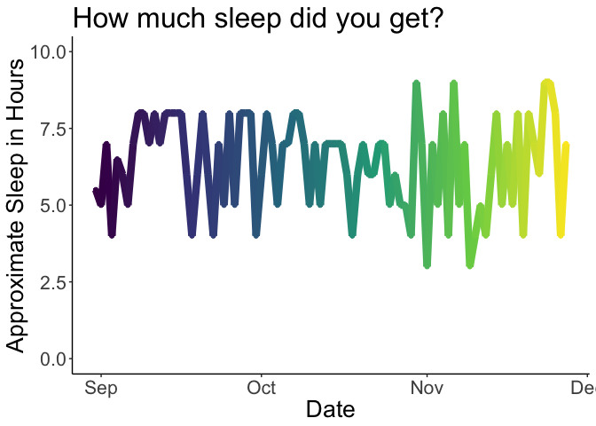

I've been using Everedoo (<https://www.eurugo.com/>) to ask me two daily questions each day since September 1, 2018. "How was your day?" and "How much sleep did you get?"

Initially I wanted to understand how my satisfaction with the day has fluctuated throughout the month. Since I was recording time spent sleeping, I expected them both to correlate but the correlation is kind of weak.

Unexpectedly, I think the fluctuation can be explained by the day before. I think the measure of satisfaction is always going to be relative because there isn't really a way to normalize. For example: if I spent a week with a series of bad days, the next okay day would seem really great in comparison. I don't know if there is a way to make these measurements more comparable over time. But that's something to look into.

TODO: I'd like to look at the days where I enter the satisfaction after the days to see if there is a positive bias. I think I like to romanticise the past and it would be cool to see if that's really what I do.
